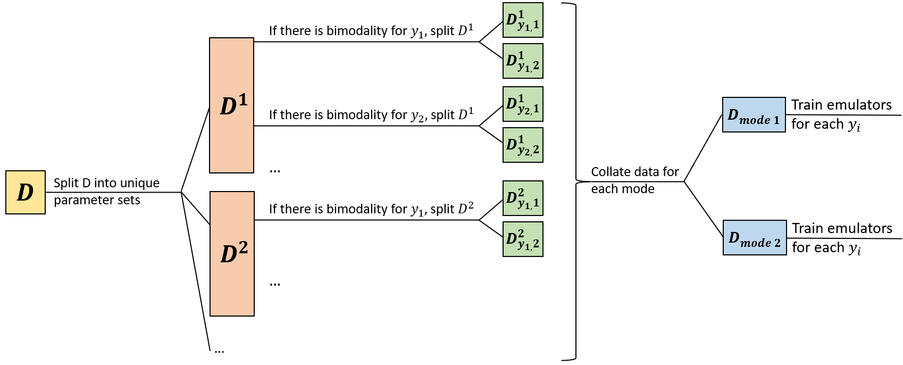

--- 
title: "Workshop 2: calibrating a stochastic model"
author: "Danny Scarponi, Andy Iskauskas"
site: bookdown::bookdown_site
output:
    bookdown::pdf_book:
        includes:
            in_header: header.tex
    bookdown::gitbook:
        config:
            sharing: null
        css: 'style.css'
        highlight: tango
        includes:
            in_header: _toggle.html
        keep_md: TRUE
bibliography: references.bib  
linkcolor: blue
documentclass: book
link-citations: yes
description: "An interactive introduction to the hmer package"
---

```{r, child = "_setup.Rmd", include = F, purl = F, cache = T}
```


```{r setup, include=F}
knitr::opts_chunk$set(echo = TRUE, cache =T)
chosen_params <- list(b = 1/(76*365), mu = 1/(76*365), beta1 = 0.214, beta2 = 0.107, beta3 = 0.428, lambda = 1/7, alpha = 1/50, gamma = 1/14, omega = 1/365)
library(hmer)
library(lhs)
library(deSolve)
library(ggplot2)
library(reshape2)
library(purrr)
library(tidyverse)
library(progressr)
handlers("progress")
set.seed(123)
############################# HELPER FUNCTIONS #############################
aggregate_points <- function(data, input_names, func = 'mean') {
  unique_points <- unique(data[,input_names])
  uids <- apply(unique_points, 1, rlang::hash)
  data_by_point <- purrr::map(uids, function(h) {
    data[apply(data[,input_names], 1, rlang::hash) == h,]
  })
  aggregate_func <- get(func)
  aggregate_values <- do.call('rbind.data.frame', purrr::map(data_by_point, function(x) {
    output_data <- x[,!(names(x) %in% input_names)]
    apply(output_data, 2, aggregate_func)
  }))
  return(setNames(cbind.data.frame(unique_points, aggregate_values), names(data)))
}
# Gillespie algorithm implementation
# N is a list containing N$M, the initial number of people in each compartment (comprising deaths), N$Post, N$Pre, N$h, T is the
# time up to which we want to simulate (400th day by default). The while loop is there to "record" only the wanted times: for 
# example, if dt=1, then we want to record only the state of the system at t=0,1,2,3,4,5,... and if the rexp(1,h0) is not enough
# to send us to the next integer time, then we will do more than one cycle and record the state only when we reach the next 
# integer time.
gillespied=function (N, T=400, dt=1, ...)
{
  tt=0
  n=T%/%dt
  x=N$M
  S=t(N$Post-N$Pre)
  u=nrow(S)
  v=ncol(S)
  xmat=matrix(0,ncol=u,nrow=n)
  i=1
  target=0
  repeat {
    h=N$h(x, tt, ...)
    h0=sum(h)
    if (h0<1e-10)
      tt=1e99
    else
      tt=tt+rexp(1,h0)
    while (tt>=target) {
      xmat[i,]=x
      i=i+1
      target=target+dt
      if (i>n)
        #			        return(ts(xmat,start=0,deltat=dt))
        return(xmat)
    }
    j=sample(v,1,prob=h)
    x=x+S[,j]
  }
}

# Initial setup: transition matrices, hazard function, and initial conditions
Num <- 1000
N=list()
N$M=c(900,100,0,0,0)
# N$Pre=matrix(c(1,0,1,1,0,1),ncol=2,byrow=TRUE)
# N$Post=matrix(c(2,0,0,2,0,0),ncol=2,byrow=TRUE)
# Columns of N$Pre are 5, for S, E, I, R, and Deaths. Rows are for transitions: births, S to E, S to D, E to I, E to D, I to D,
# I to R, R to S, R to D. For example: the first row is all of zeros, since we need no person in S, nor in the other compartments 
# for a new birth to happen. 
# Columns of N$Post are 5 as for N$Pre. Rows are for transitions as for N$Pre. For example: the element in (1,1) is 1 since a new 
# birth goes straight into the S compartment. 
N$Pre = matrix(c(0,0,0,0,0,
                 1,0,0,0,0,
                 1,0,0,0,0,
                 0,1,0,0,0,
                 0,1,0,0,0,
                 0,0,1,0,0,
                 0,0,1,0,0,
                 0,0,0,1,0,
                 0,0,0,1,0), ncol = 5, byrow = TRUE)
N$Post = matrix(c(1,0,0,0,0,
                  0,1,0,0,0,
                  0,0,0,0,1,
                  0,0,1,0,0,
                  0,0,0,0,1,
                  0,0,0,0,1,
                  0,0,0,1,0,
                  1,0,0,0,0,
                  0,0,0,0,1), ncol = 5, byrow = TRUE)
# N$Pre=matrix(c(1,0,0,0,1,0,1,0,0),ncol=3,byrow=TRUE)
# N$Post=matrix(c(0,1,0,0,0,1,0,0,1),ncol=3,byrow=TRUE)
# Here x is the vector with the number of people in each of the compartments (deaths excluded), t is the time and th is a vector
# with the parameters. N$h return a vector with all the transition rates at time t.
N$h=function(x,t,th=rep(1,9))
{
  Num = x[1]+x[2]+x[3]+x[4]
  if (t > 270) tns <- th[5]
  else if (t > 180) tns <- (th[5]-th[4])*t/90+3*th[4]-2*th[5]
  else if (t > 100) tns <- th[4]
  else tns <- (th[4]-th[3])*t/100+th[3]
  return(
    c(th[1]*Num,
      tns*x[3]*x[1]/Num,
      th[2]*x[1],
      th[6]*x[2],
      th[2]*x[2],
      (th[7]+th[2])*x[3],
      th[8]*x[3],
      th[9]*x[4],
      th[2]*x[4])
  )
}

get_results <- function(params, nreps = 100, outs, times, raw = FALSE) {
  tseq <- 0:max(times)
  arra <- array(0, dim = c(max(tseq)+1, 5, nreps))
  for(i in 1:nreps) arra[,,i] <- gillespied(N,T=max(times) + 1 + 0.001,dt=1,th=params)
  if(raw) return(arra)
  collected <- list()
  for (i in 1:nreps) {
    relev <- c(arra[times+1, which(c("S", "E", "I", "R", "D") %in% outs), i])
    names <- unlist(purrr::map(outs, ~paste0(., times, sep = "")))
    relev <- setNames(relev, names)
    collected[[i]] <- relev
  }
  input_dat <- setNames(data.frame(matrix(rep(params, nreps), ncol = length(params), byrow = TRUE)), names(params))
  return(cbind(input_dat, do.call('rbind', collected)))
}
```

# Objectives

In this workshop, you will learn how to perform history matching with emulation on stochastic models, using the [hmer](https://github.com/Tandethsquire/hmer) package. Much of the calibration process is the same for stochastic and deterministic models, and we therefore recommend that before starting this workshop you complete [Workshop 1](https://danny-sc.github.io/determ_workshop/index.html), which shows how to perform history matching with emulation on deterministic models. In this workshop, we cover the overall process in less detail, with new information that is specific to stochastic models highlighted using boxes:

```{info, title = NA, collapsible = FALSE}

Boxes like these contain material that is specific to the calibration of stochastic models, and is therefore not covered in the deterministic workshop.

```

When calibrating a stochastic model, in many applications the primary interest consists in identifying all parameter sets for which the mean of the model closely matches the observed data. An epidemiological example of this situation is when individual-based models are used (e.g. to account for household structure and transmission between household members), even though the aim is to study the average model output across multiple runs and there is no interest in the stochasticity of the model in itself. In other applications, the interest is instead in examining the properties and behaviour of all possible trajectories of the model, and in finding the parameter sets that can produce trajectories matching the observed data. In epidemiology, this is for example the case when we are dealing with small populations and we are directly interested in the stochasticity of the model (e.g. if we want to answer the following question: after an infected individual is inserted in a population, does transmission take off or die out?). In this workshop we focus on the former case and develop an emulator structure that helps us match to the mean of the model. This allows us to rule out large portions of the input parameter space, and it can be very useful even in the case in which one is interested in single trajectories of the model. An implementation of history matching with emulation dealing with single realisations of stochastic models will appear in future versions of our package.   

Before starting the tutorial, you will need to run the code contained in the box below: it will load all relevant dependencies and a few helper functions which will be introduced and used later.   

```{info, title="Code to load relevant libraries and helper functions"}

``{r, eval=F}
library(hmer)
library(lhs)
library(deSolve)
library(ggplot2)
library(reshape2)
library(purrr)
library(tidyverse)
library(progressr)
handlers("progress")
############################# HELPER FUNCTIONS #############################
# Function that calculates the mean of the model outputs from several runs 
# at the same parameter set 
aggregate_points <- function(data, input_names, func = 'mean') {
  unique_points <- unique(data[,input_names])
  uids <- apply(unique_points, 1, rlang::hash)
  data_by_point <- purrr::map(uids, function(h) {
    data[apply(data[,input_names], 1, rlang::hash) == h,]
  })
  aggregate_func <- get(func)
  aggregate_values <- do.call('rbind.data.frame', purrr::map(data_by_point, function(x) {
    output_data <- x[,!(names(x) %in% input_names)]
    apply(output_data, 2, aggregate_func)
  }))
  return(setNames(cbind.data.frame(unique_points, aggregate_values), names(data)))
}
# Function that implements the SEIRS stochastic model using the Gillespie algorithm
gillespied=function (N, T=400, dt=1, ...)
{
  tt=0
  n=T%/%dt
  x=N$M
  S=t(N$Post-N$Pre)
  u=nrow(S)
  v=ncol(S)
  xmat=matrix(0,ncol=u,nrow=n)
  i=1
  target=0
  repeat {
    h=N$h(x, tt, ...)
    h0=sum(h)
    if (h0<1e-10)
      tt=1e99
    else
      tt=tt+rexp(1,h0)
    while (tt>=target) {
      xmat[i,]=x
      i=i+1
      target=target+dt
      if (i>n)
        return(xmat)
    }
    j=sample(v,1,prob=h)
    x=x+S[,j]
  }
}
Num <- 1000
N=list()
N$M=c(900,100,0,0,0)
N$Pre = matrix(c(0,0,0,0,0,
                 1,0,0,0,0,
                 1,0,0,0,0,
                 0,1,0,0,0,
                 0,1,0,0,0,
                 0,0,1,0,0,
                 0,0,1,0,0,
                 0,0,0,1,0,
                 0,0,0,1,0), ncol = 5, byrow = TRUE)
N$Post = matrix(c(1,0,0,0,0,
                  0,1,0,0,0,
                  0,0,0,0,1,
                  0,0,1,0,0,
                  0,0,0,0,1,
                  0,0,0,0,1,
                  0,0,0,1,0,
                  1,0,0,0,0,
                  0,0,0,0,1), ncol = 5, byrow = TRUE)
N$h=function(x,t,th=rep(1,9))
{
  Num = x[1]+x[2]+x[3]+x[4]
  if (t > 270) tns <- th[5]
  else if (t > 180) tns <- (th[5]-th[4])*t/90+3*th[4]-2*th[5]
  else if (t > 100) tns <- th[4]
  else tns <- (th[4]-th[3])*t/100+th[3]
  return(
    c(th[1]*Num,
      tns*x[3]*x[1]/Num,
      th[2]*x[1],
      th[6]*x[2],
      th[2]*x[2],
      (th[7]+th[2])*x[3],
      th[8]*x[3],
      th[9]*x[4],
      th[2]*x[4])
  )
}
# Function that takes a dataframe of parameter sets and returns 
# the model outputs from 100 runs at each parameter set
get_results <- function(params, nreps = 100, outs, times, raw = FALSE) {
  tseq <- 0:max(times)
  arra <- array(0, dim = c(max(tseq)+1, 5, nreps))
  for(i in 1:nreps) arra[,,i] <- gillespied(N,T=max(times) + 1 + 0.001,dt=1,th=params)
  if(raw) return(arra)
  collected <- list()
  for (i in 1:nreps) {
    relev <- c(arra[times+1, which(c("S", "E", "I", "R", "D") %in% outs), i])
    names <- unlist(purrr::map(outs, ~paste0(., times, sep = "")))
    relev <- setNames(relev, names)
    collected[[i]] <- relev
  }
  input_dat <- setNames(data.frame(matrix(rep(params, nreps), ncol = length(params), byrow = TRUE)), names(params))
  return(cbind(input_dat, do.call('rbind', collected)))
}
``

```

# An overview of history matching with emulation and hmer

In this section we briefly recap the history matching with emulation workflow and we explain how various steps of the process can be performed using hmer functions.

``` {r, echo = FALSE, fig.cap='History matching with emulation workflow'}
knitr::include_graphics('hme_flowchart_cut.png')
```

As shown in the above image, history matching with emulation proceeds in the following way:

1. The model is run on the initial design points, a manageable number of parameter sets that are spread out uniformly across the input space.
2. Emulators are built using the training data (model inputs and outputs) provided by the model runs.
3. Emulators are tested, to check whether they are good approximations of the model outputs.
4. Emulators are evaluated at a large number of parameter sets. The implausibility of each of these is then assessed, and the model run using parameter sets classified as non-implausible. 
5. The process is stopped or a new wave of the process is performed, going back to step 2.

```{r, table_funcs, include = FALSE}
knitr::include_graphics('table_functions.png')
```

```{info, title = NA, collapsible=FALSE}
The table below associates each step of the process with the corresponding hmer function. Note that 
step 1 and 5 are not in the table, since they are specific to each model and calibration task. 
The last column of the table indicates what section of this workshop deals with each step of the process.    
``{r, echo=FALSE, ref.label = "table_funcs", out.width="120%"}
``
```

# Introduction to the model {#intro}
In this section we introduce the model that we will work with throughout our workshop. To facilitate the comparison between the deterministic and the stochastic setting, we will work with the <span class="abbr" title="A model consisting of four compartments 

- $S$: Susceptible individuals,
- $E$: Exposed individuals (i.e. people that are infected but not infectious yet), 
- $I$: Infectious individuals,  
- $R$: Recovered individuals, 

and four possible transitions

- $S \rightarrow E$, when a susceptible individual becomes infected, 
- $E \rightarrow I$, when an infected individual becomes infectious,
- $I \rightarrow R$, when an infectious individual recovers,
- $R \rightarrow S$, when a recovered individual becomes susceptible again.

SEIRS models are used to study those infectious diseases that do not confer permanent immunity."><abbr title="A model consisting of four compartments 

- S: Susceptible individuals,
- E: Exposed individuals (i.e. people that are infected but not infectious yet), 
- I: Infectious individuals,  
- R: Recovered individuals, 

and four possible transitions

- S to E, when a susceptible individual becomes infected, 
- E to I, when an infected individual becomes infectious,
- I to R, when an infectious individual recovers,
- R to S, when a recovered individual becomes susceptible again.

SEIRS models are suitable to study those infectious diseases that have an incubation period and do not confer permanent immunity.">
SEIRS</abbr></span>
model which we used in [Workshop 1](https://danny-sc.github.io/determ_workshop/index.html), but this time we introduce stochasticity. The deterministic SEIRS model used in [Workshop 1](https://danny-sc.github.io/determ_workshop/index.html) was described by the following differential equations:

\begin{align}
\frac{dS}{dt} &= b N - \frac{\beta(t)IS}{N} + \omega R -\mu S  \\ 
\frac{dE}{dt} &= \frac{\beta(t)IS}{N} - \epsilon E - \mu E \\ 
\frac{dI}{dt} &= \epsilon E - \gamma I - (\mu + \alpha) I \\ 
\frac{dR}{dt} &= \gamma I - \omega R - \mu R
\end{align}

where $N$ is the total population, varying over time, and the parameters are as follows:

- $b$ is the birth rate, 

- $\mu$ is the  rate of death from other causes, 

- $\beta(t)$ is the infection rate between each infectious and susceptible individual, 

- $\epsilon$ is the rate of becoming infectious after infection, 

- $\alpha$ is the rate of death from the disease, 

- $\gamma$ is the recovery rate and  

- $\omega$ is the rate at which immunity is lost following recovery. 

``` {r, echo = FALSE, fig.cap='SEIRS Diagram'}
knitr::include_graphics('seirs.png')
```


The rate of infection between each infectious and susceptible person $\beta(t)$ is set to be a simple linear function interpolating between points, where the points in question are $\beta(0)=\beta_1$, $\beta(100) = \beta(180) = \beta_2$, $\beta(270) = \beta_3$ and where $\beta_2 < \beta_1 < \beta_3$. This choice was made to represent an infection rate that initially drops due to external (social) measures and then raises when a more infectious variant appears. Here $t$ is taken to measure days. Below we show a graph of the infection rate over time when $\beta_1=0.3, \beta_2=0.1$ and $\beta_3=0.4$:

``` {r, echo = FALSE, fig.cap='Graph of the rate of infection between each infectious and susceptible person', out.width="60%"}
knitr::include_graphics('infection_rate.png')
```

```{info, title = NA, collapsible = FALSE}
In order to obtain the solutions of the stochastic SEIR model for a given set of parameters, we will use a helper function, `get_results` (which is defined in the R-script). This function assumes an initial population of 900 susceptible individuals, 100 exposed individuals, and no infectious or recovered individuals, and uses the Gillespie algorithm to generate trajectories of the model. The minimum specifications for this function are: the parameter set(s) to run the model on, a set of outputs (e.g. `c("S","R")`), and a set of times (e.g. `c(10,100,150)`) that we are interested in. The default behaviour of `get_results` is to run the model 100 times on the parameter set(s) provided, but more or fewer repetitions can be obtained, using the argument `nreps`. The function `get_results` returns a dataframe containing a row for each repetition at each parameter set provided, with the first nine columns showing the values of the parameters and the subsequent columns showing the requested outputs at the requested times. If `raw` is set to `TRUE`, all outputs and all times are instead returned: this is useful if we want to plot "continuous" trajectories.
```

As in [Workshop 1](https://danny-sc.github.io/determ_workshop/index.html), the outputs obtained with the parameter set

```{r}
chosen_params <- c(
  b = 1/(76*365),
  mu = 1/(76*365),
  beta1 = 0.214, beta2 = 0.107, beta3 = 0.428,
  epsilon = 1/7,
  alpha = 1/50,
  gamma = 1/14,
  omega = 1/365
)
```

will be used to define the target bounds for our calibration task. 

```{info, title = NA, collapsible = FALSE}
Using `get_results` on `chosen_params` 

``{r, fig.height=7, fig.width=7}
solution <- get_results(chosen_params, outs = c("I", "R"), 
                       times = c(25, 40, 100, 200), raw = TRUE)
``

we get a 3-dimensional array `solution` such that `solution[t,j,i]` contains the number of individuals in the j-th compartment at time $t$ for the i-th run of the model at `chosen_params`. In particular, $t$ can take values $1,2,...,201$, $j$ can take values $1,2,3,4,5$ corresponding to $S, E, I, R, D$ (where $D$ stands for the cumulative number of deaths occurred), and $i$ can be $1,2,3,...,100$. 
```

Plotting the results for "I" and "R", we have

```{r, fig.height=7, fig.width=7}
plot(0:200, ylim=c(0,700), ty="n", xlab = "Time", ylab = "Number")
for(j in 3:4) for(i in 1:100) lines(0:200, solution[,j,i], col=(3:4)[j-2], lwd=0.3)
legend('topleft', legend = c('Infected', "Recovered"), lty = 1, 
       col = c(3,4), inset = c(0.05, 0.05))
```

The plot above clearly shows the stochasticity of our model. Furthermore we can also appreciate how the spread of the runs varies across the time: for example, the variance in the number of infected individuals is largest around $t=40$ and quite small at later times.


Plotting the results for "S" also shows stochasticity:

```{r, fig.height=7, fig.width=7}
plot(0:200, ylim=c(0,1000), ty="n", xlab = "Time", ylab = "Number", main = "Susceptibles")
for(i in 1:100) lines(0:200, solution[,1,i], col='black', lwd=0.3, 
                      xlab = "Time", ylab = "Number", main = "Susceptibles")
```

```{r, rtip1, eval = FALSE, echo = FALSE}

Copy the code below, modify the value of (some) parameters and run it.

``{r, eval = FALSE}
example_params <- c(
  b = 1/(76*365),  # birth rate
  mu = 1/(76*365),  # rate of death from other causes
  beta1 = 0.214, beta2 = 0.107, beta3 = 0.428,  # infection rate between each infectious and susceptible individual
  epsilon = 1/7,  # rate of becoming infectious after infection
  alpha = 1/50,  # rate of death from the disease
  gamma = 1/14,  # recovery rate
  omega = 1/365  # rate at which immunity is lost following recovery
)
solution <- get_results(example_params, outs = c("I", "R"), 
                        times = c(25, 40, 100, 200), raw = TRUE)
plot(0:200, ylim=c(0,700), ty="n", xlab = "Time", ylab = "Number")
for(j in 3:4) for(i in 1:100) lines(0:200, solution[,j,i], col=(3:4)[j-2], lwd=0.3)
legend('topleft', legend = c('Infected', "Recovered"), lty = 1, 
       col = c(3,4), inset = c(0.05, 0.05))
``

```


```{task}

If you would like, familiarise yourself with the model. Investigate how the plots change as you change the values of the parameters.

``{info, title = "R tip", collapsible = TRUE, ref.label = "rtip1"}
``

```


```{solution}
Let us see what happens when a higher rate of infection between each infectious and susceptible person is considered. We first rerun the model on `example_params` to ensure that `solution` contains the correct trajectories:
  
``{r, fig.height=8, fig.width=8}
example_params <- c(
  b = 1/(76*365),  # birth rate
  mu = 1/(76*365),  # rate of death from other causes
  beta1 = 0.214, beta2 = 0.107, beta3 = 0.428,  # infection rate between each infectious and susceptible individual
  epsilon = 1/7,  # rate of becoming infectious after infection
  alpha = 1/50,  # rate of death from the disease
  gamma = 1/14,  # recovery rate
  omega = 1/365  # rate at which immunity is lost following recovery
)
solution <- get_results(example_params, outs = c("I", "R"), 
                        times = c(25, 40, 100, 200), raw = TRUE)
higher_beta_params <- c(
  b = 1/(76*365),
  mu = 1/(76*365),
  beta1 = 0.3, beta2 = 0.1, beta3 = 0.5,
  epsilon = 1/7,
  alpha = 1/50,
  gamma = 1/14,
  omega = 1/365
)
higher_beta_solution <- get_results(higher_beta_params, outs = c("I", "R"), 
                                   times = c(25, 40, 100, 200), raw = TRUE)
plot(0:200, ylim=c(0,700), ty="n", xlab = "Time", ylab = "Number")
for(j in 3:4) for(i in 1:100) lines(0:200, higher_beta_solution[,j,i], 
                                    col=(c("#E69F00","#CC79A7"))[j-2], lwd=0.3)
for(j in 3:4) for(i in 1:100) lines(0:200, solution[,j,i], col=(3:4)[j-2], lwd=0.3)
legend('topleft', legend = c('Infected', "Recovered", "Infected - higher beta", 
                             "New Recovered - higher beta"), lty = 1, 
       col = c(3,4,"#E69F00","#CC79A7"), inset = c(0.01, 0.01))
``

We see that the peaks of recovered and infectious individuals have now increased, as expected. 
What happens when a lower value of the recovery rate $\gamma$ is used?
``{r, fig.height=8, fig.width=8}
smaller_gamma_params <- c(
  b = 1/(60*365),
  mu = 1/(76*365),
  beta1 = 0.214, beta2 = 0.107, beta3 = 0.428,
  epsilon = 1/7,
  alpha = 1/50,
  gamma = 1/20,
  omega = 1/365
)
smaller_gamma_solution <- get_results(smaller_gamma_params, outs = c("I", "R"), 
                                      times = c(25, 40, 100, 200), raw = TRUE)
plot(0:200, ylim=c(0,700), ty="n", xlab = "Time", ylab = "Number")
for(j in 3:4) for(i in 1:100) lines(0:200, smaller_gamma_solution[,j,i], 
                                    col=(c("#E69F00","#CC79A7"))[j-2], lwd=0.3)
for(j in 3:4) for(i in 1:100) lines(0:200, solution[,j,i], col=(3:4)[j-2], lwd=0.3)
legend('topleft', legend = c('Infected', "Recovered", "Infected - smaller gamma", 
                             "Recovered - smaller gamma"), lty = 1, 
       col = c(3,4,"#E69F00","#CC79A7"), inset = c(0.01, 0.01))
``

As one expects, this causes the peak of infectious individuals to increase.
Finally, what happens when we increase the rate at which immunity is lost $\omega$?
  
``{r, fig.height=8, fig.width=8}
higher_omega_params <- c(
  b = 1/(60*365),
  mu = 1/(76*365),
  beta1 = 0.214, beta2 = 0.107, beta3 = 0.428,
  epsilon = 1/7,
  alpha = 1/50,
  gamma = 1/14,
  omega = 0.004
)
higher_omega_solution <- get_results(higher_omega_params, outs = c("I", "R"), 
                                      times = c(25, 40, 100, 200), raw = TRUE)
plot(0:200, ylim=c(0,700), ty="n", xlab = "Time", ylab = "Number")
for(j in 3:4) for(i in 1:100) lines(0:200, higher_omega_solution[,j,i], 
                                    col=(c("#E69F00","#CC79A7"))[j-2], lwd=0.3)
for(j in 3:4) for(i in 1:100) lines(0:200, solution[,j,i], col=(3:4)[j-2], lwd=0.3)
legend('topleft', legend = c('Infected', "Recovered", "Infected - higher omega", 
                             "Recovered - higher omega"), lty = 1, 
       col = c(3,4,"#E69F00","#CC79A7"), inset = c(0.05, 0.05))
``

This causes the peak of recovered individuals to slightly decrease.
```


# 'wave0' - parameter ranges, targets and design points
In this section we set up the emulation task, defining the input parameter ranges, the calibration targets and all the data necessary to build the first wave of emulators. Note that, for the sake of clarity, in this workshop we will adopt the word 'data' only when referring to the set of runs of the model that are used to train emulators. Empirical observations, that would inform our choice of targets if we were modelling a real-world scenario, will instead be referred to as 'observations'.

First of all, let us set the parameter ranges:
  
```{r}
ranges = list(
  b = c(1e-5, 1e-4), # birth rate
  mu = c(1e-5, 1e-4), # rate of death from other causes
  beta1 = c(0.05, 0.3), # infection rate at time t=0
  beta2 = c(0.1, 0.2), # infection rates at time t=100
  beta3 = c(0.3, 0.5), # infection rates at time t=270
  epsilon = c(0.01, 0.21), # rate of becoming infectious after infection
  alpha = c(0.01, 0.025), # rate of death from the disease
  gamma = c(0.01, 0.08), # recovery rate
  omega = c(0.002, 0.004) # rate at which immunity is lost following recovery
)
```

We then turn to the targets we will match: the number of infectious individuals $I$ and the number of recovered individuals $R$ at times $t=25, 40, 100, 200$. The targets can be specified by a pair (val, sigma), where ‘val’ represents the measured value of the output and ‘sigma’ represents its standard deviation, or by a pair (min, max), where min represents the lower bound and max the upper bound for the target. Since in [Workshop 1](https://danny-sc.github.io/determ_workshop/index.html) we used the former formulation, here we will show the latter: 
  
```{r}
targets <- list(
  I25 = c(98.51, 133.25),
  I40 = c(117.17, 158.51),
  I100 = c(22.39, 30.29),
  I200 = c(0.578, 0.782),
  R25 = c(106.34, 143.9),
  R40 = c(218.28, 295.32),
  R100 = c(458.14, 619.84),
  R200 = c(377.6, 510.86)
)
``` 

The 'sigmas' in our `targets` list represent the uncertainty we have about the observations. Note that in general we can also choose to include model uncertainty in the 'sigmas' to reflect how accurate we think our model is.     

For this workshop, we generate parameter sets using a [Latin Hypercube](https://en.wikipedia.org/wiki/Latin_hypercube_sampling) design. A rule of thumb is to select at least $10p$ parameter sets to train emulators, where $p$ is the number of parameters (9 in this workshop). Using the function `maximinLHS` in the package `lhs`, we create a hypercube design with 100 parameter sets for the training set and one with 50 parameter sets for the validation set. Note that we could have chosen $100$ parameter sets for the validation set: we chose $50$ simply to highlight that it is not necessary to have as many validation points as training points. Especially when working with expensive models, this can be useful and can help us manage the computational burden of the procedure. After creating the two hypercube designs, we bind them together to create `initial_LHS`:

```{r}
initial_LHS_training <- maximinLHS(100, 9)
initial_LHS_validation <- maximinLHS(50, 9)
initial_LHS <- rbind(initial_LHS_training, initial_LHS_validation)
```

Note that in `initial_LHS` each parameter is distributed on $[0,1]$. This is not exactly what we need, since each parameter has a different range. We therefore re-scale each component in `initial_LHS` multiplying it by the difference between the upper and lower bounds of the range of the corresponding parameter and then we add the lower bound for that parameter. In this way we obtain `initial_points`, which contains parameter values in the correct ranges. 

```{r}
initial_points <- setNames(data.frame(t(apply(initial_LHS, 1, 
                                        function(x) x * purrr::map_dbl(ranges, diff) + 
                                        purrr::map_dbl(ranges, ~.[[1]])))), names(ranges))
```

We then run the model for the parameter sets in `initial_points` through the `get_results` function, specifying that we are interested in the outputs for $I$ and $R$ at times $t=25, 40, 100, 200$. Note that we use the `progressr` package to create a progress bar that updates every time a new parameter set is run: when you run the code on your own, this will indicate at what stage of the process you are. 

```{r}
initial_results <- list()
with_progress({
  p <- progressor(nrow(initial_points))
for (i in 1:nrow(initial_points)) {
  model_out <- get_results(unlist(initial_points[i,]), nreps = 25, outs = c("I", "R"), 
                           times = c(25, 40, 100, 200))
  initial_results[[i]] <- model_out
  p(message = sprintf("Run %g", i))
}
})
```

Note that `initial_results` is a list of length $3750$, since it has a row for each of the 25 repetitions of the 150 parameter sets in `initial_points`.  Finally, we bind all elements in `initial_results`  to obtain a data frame `wave0 ` and we split it
in two parts: the first 2500 elements (corresponding to the first 100 parameter sets) for the training set, `all_training`, and the last 1250 for the validation set (corresponding to the last 50 parameter sets), `all_valid`.

```{r}
wave0 <- data.frame(do.call('rbind', initial_results))
all_training <- wave0[1:2500,]
all_valid <- wave0[2501:3750,]
output_names <- c("I25", "I40", "I100", "I200", "R25", "R40", "R100", "R200")
```


# Emulators 

In this section we will train stochastic emulators, which take into account the fact that each time the model is run using the same parameter set, it will generate different output.

## Brief recap on the structure of an emulator

We very briefly recap the general structure of a univariate emulator (see [Workshop 1](https://danny-sc.github.io/determ_workshop/index.html) for more details):

$$f(x) = g(x)^T \xi + u(x),$$

where $g(x)^T \xi$ is a regression term and $u(x)$ is a [weakly stationary process](https://en.wikipedia.org/wiki/Stationary_process#Weak_or_wide-sense_stationarity) with mean zero. 

The regression term, which mimics the global behaviour of the model output, is specified by a vector of functions of the parameters $g(x)$ which determine the shape and complexity of the regression 
<span class="abbr" title=""><abbr title="A hypersurface is a mathematical object that generalizes the concept of surface from the three-dimensional space to hyperspaces, i.e. spaces of dimension higher than three.
">hypersurface</abbr></span> we fit to the training data, and a vector of regression coefficients $\xi$. 

The [weakly stationary process](https://en.wikipedia.org/wiki/Stationary_process#Weak_or_wide-sense_stationarity) $u(x)$ (similar to a [Gaussian process](https://en.wikipedia.org/wiki/Gaussian_process)), accounts for the local deviations (or residuals) of the output from the regression hypersurface.

In this workshop, $u(x)$ is assumed to be a Gaussian process, with covariance structure given by 

$$\text{Cov}(u(x), u(x'))= \sigma^2  c(x,x^{\prime}) $$
  
where  $c$ is the square-exponential correlation function

$$c(x,x^{\prime}) :=  \exp\left(\frac{-\sum\limits_{i}(x_{i}-x_{i}^{\prime})^2}{\theta^2}\right)$$
  
where $x_i$ is the ith-component of the parameter set $x.$ The term $\sigma^2$ is the **emulator variance**, i.e. the variance of $u(x)$, and reflects how far we expect the output to be from the regression hypersurface, while 
$\theta$ is the **correlation length** of the process, and determines how close two parameter sets must be in order for the corresponding residuals to be non-negligibly correlated. 

```{info, title = NA, collapsible = FALSE}
In the deterministic workshop, we said that in order to train an emulator, the `emulator_from_data` function first estimated the value for $\sigma$, using the provided training data. It is important to note that **this estimated value of $\sigma$ was constant**, i.e., it was the same for all parameter sets. When working with stochastic models, different areas of the parameter space often give rise to quite different levels of stochasticity in the outputs. Taking this phenomenon into account when dealing with stochastic models will allow us to train more accurate and efficient emulators. 
```

## Stochastic emulators

```{info, title = NA, collapsible = FALSE}
To train stochastic emulators we use the function `variance_emulator_from_data`, which requires the training data, the names of the outputs to emulate, and the ranges of the parameters:

``{r, fig.height=7, fig.width=7}
stoch_emulators <- variance_emulator_from_data(all_training, output_names, ranges)
``

The function `variance_emulator_from_data` returns two sets of emulators: one for the variance and one for the expectation of each model output. Behind the scenes, `variance_emulator_from_data` does the following:

- First, it estimates the variance of each model output of interest at each provided parameter set: this is possible since `all_training` contains several model runs at each parameter set. 


- Using the obtained variance data, it then trains an emulator for the variance of each of the outputs of interest. These emulators will be referred to as **variance emulators** and can be access typing `stoch_emulators$variance`.

- Finally, emulators for the mean of each output are built. These emulators will be referred to as mean emulators and can be accessed typing `stoch_emulators$expectation`. The main difference in the training of emulators between the stochastic and the deterministic case is that here, for each output, we use the variance emulator to inform our choice for a component of $\sigma$, that which is due to the stochasticity of the model: for each parameter set $x$, the variance emulator gives us an estimate of the variance of the model output at $x$. Note that this step is specific to the treatment of stochastic models, where it is important to account for the fact that different areas of the parameter space often give rise to quite different levels of stochasticity in the outputs.

```

Let's take a look at the two sets of emulators stored in `stoch_emulators`, starting with plots of active variables:

```{r, fig.height=5, fig.width=6}
plot_actives(stoch_emulators$variance)
plot_actives(stoch_emulators$expectation)
```

These plots show what variables are active, i.e. have the most explanatory power, for each of the mean and variance emulators. We see that $b$ and $\mu$ are inactive for almost all outputs in the variance emulators, even though they are active for some outputs in the mean emulators. Parameters $\beta_1$, $\epsilon$, $\alpha$ and $\gamma$ are active for most or all outputs in the mean emulators. 

As in the deterministic case, the `emulator_plot` can be used to visualise how emulators represent the output space. Since we have two sets of emulators, we have several options in terms of plots. The default behaviour of `emulator_plot` is to plot the expectation of the passed emulator: for example, to plot the expectation of the variance emulator for $I40$, we just need to pass `stoch_emulators$variance$I40` to `emulator_plot`.


```{info, title = NA, collapsible = FALSE}
It is important to stress the following point: unlike in the deterministic case, here mean emulators do not have zero variance at  'known' points, i.e., at points in the training set. Let us verify this, by plotting the variance of the mean emulator for $I100$ in the $(\epsilon,\alpha)$-plane, with all unshown parameters to be as in the first row of `all_training`. Note that since the plot produced below depends on the location of the first run, when running the code with your own `all_training` you will get a different result:

``{r, fig.height=7, fig.width=9}
emulator_plot(stoch_emulators$expectation$I100, params = c('epsilon', 'alpha'),
     fixed_vals = all_training[1, names(ranges)[-c(6,7)]], plot_type = 'var') +
   geom_point(data = all_training[1,], aes(x = epsilon, y = alpha))
``

We see that the black point in the dark blue area, corresponding to the first point in `all_training`, does not have variance zero. This is because the mean emulator is trying to predict the 'true' mean at the point, but it has only been given a sample mean, which it cannot assume is equal to the 'true' mean. The emulator internally compensates for this incomplete information, resulting in the variance not being zero, even at points in the training set. This compensation also means that we can work with different numbers of replicates at different parameter sets. In general, for each training/validation parameter set, we should use as many repetitions as is feasible given the model complexity. More repetitions will provide a better estimate of the variance, which in turn allows to train more accurate mean emulators. If a model is relatively fast, then it is worth doing 50-100 repetitions per parameter set; if it is slower, then we can work with fewer repetitions (even just 5-10 per parameter set). This applies to different regions of the parameter space within a single model, too: if one part of the parameter space is much slower to run (e.g. parameter sets with higher beta values, which tend to produce more infections, slowing down agent-based models), then we could run fewer repetitions in those parts of parameter space. 
```
 

# Implausibility 

We will first briefly review the definition of an implausibility measure. For a given stochastic model output and a given target, the implausibility measures the difference between the output and the target, taking into account all sources of uncertainty. For a parameter set $x$, a particular choice of implausibility, useful for either matching to the mean of the stochastic model, or its spread of possible values, is:

$$\text{Imp}(x) = \frac{|\text{E}[m(x)]-z|}{\sqrt{V_0 + V_c(x)+V_s(x)+V_m}},$$

where $\text{E}[m(x)]$ is the expected value of the mean of the stochastic model, $z$ the target, and the terms in the denominator refer to various forms of uncertainty. In particular

- $V_0$ is the variance associated with the observation uncertainty;
- $V_c(x)$ refers to the uncertainty one introduces when using the emulator output instead of the model output itself;
- $V_s(x)$ is the ensemble variability and represents the stochastic nature of the model. This term is used to create an appropriate representation of the uncertainty on either the mean or the set of possible realisations of the stochastic model.
- $V_m$ is the model discrepancy, accounting for possible mismatches between the model and reality.

Since in this case study we want to emulate our model, without reference to a real-life analogue, the model represents the reality perfectly. For this reason we have $V_m=0$. The term $V_s$, which was zero when we worked on the deterministic SEIRS model ([Workshop 1](https://danny-sc.github.io/determ_workshop/index.html)), is now non-zero, in order to account for the stochasticity of the model.

A very large value of $\text{Imp}(x)$ means that we can be confident that the parameter set $x$ does not provide a good match to the observed data, even factoring in the additional uncertainty that comes with the use of emulators.

To plot the maximum implausibility (across all emulators), we set `plot_type` to `nimp` in the call to `emulator_plot`:

```{r, fig.height=7, fig.width=9}
emulator_plot(stoch_emulators, plot_type = 'nimp', 
              targets = targets, params = c('epsilon', 'alpha'))
```

```{task}
Use the argument `fixed_vals` to set the parameters that are not shown in the plot to be as in `chosen_params`. Verify that the implausibility at `chosen_params` is below 3.
```

```{solution}
We set `fixed_vals` to `chosen_params[!names(chosen_params) %in% c('epsilon', 'alpha')]`, plot the maximum implausibility and add a point corresponding to the values of $\sigma$ and $alpha$ in `chosen_params`:
``{r fig.width = 7, fig.height = 6}
emulator_plot(stoch_emulators, plot_type = 'nimp', targets = targets,
              params = c('epsilon', 'alpha'),
              fixed_vals = chosen_params[!names(chosen_params) %in% c('epsilon', 'alpha')], 
              cb=T) +geom_point(aes(x=1/7, y=1/50), size=3)
``
The plot shows what we expected: when $\epsilon$ and $\alpha$ are equal to their values in `chosen_params`, the implausibility measure is below the threshold $3$ (cf. black point in the box). 
```

# Emulator diagnostics

The function `validation_diagnostics` can be used as in the deterministic case, to get three diagnostics for each emulated output.

```{info, title="Remind me of what each diagnostics means"}
**The first column** shows the emulator outputs plotted against the model outputs. In particular, the emulator expectation is plotted against the model output for each validation point, providing the dots in the graph. The emulator uncertainty at each validation point is shown in the form of a vertical interval that goes from $3\sigma$ below to $3\sigma$ above the emulator expectation, where $\sigma$ is the emulator variance at the considered point.  An 'ideal' emulator would exactly reproduce the model results: this behaviour is represented by the green line $f(x)=E[f(x)]$ (this is a diagonal line, visible here only in the bottom left and top right corners). Any parameter set whose emulator prediction lies more than $3\sigma$ away from the model output is highlighted in red. Note that we do not need to have no red points for the test to be passed: since we are plotting $3\sigma$ bounds, statistically speaking it is ok to have up to $5\%$ of validation points in red (see [Pukelsheim's $3\sigma$ rule](https://en.wikipedia.org/wiki/68%E2%80%9395%E2%80%9399.7_rule)).

**The second column** compares the emulator implausibility to the equivalent model implausibility (i.e. the implausibility calculated replacing the emulator output with the model output). There are three cases to consider:
  
  - The emulator and model both classify a set as implausible or non-implausible (bottom-left and top-right quadrants). This is fine. Both are giving the same classification for the parameter set. 
- The emulator classifies a set as non-implausible, while the model rules it out (top-left quadrant): this is also fine. The emulator should not be expected to shrink the parameter space as much as the model does, at least not on a single wave. Parameter sets classified in this way will survive this wave, but may be removed on subsequent waves as the emulators grow more accurate on a reduced parameter space.
- The emulator rules out a set, but the model does not (bottom-right quadrant): these are the problem sets, suggesting that the emulator is ruling out parts of the parameter space that it should not be ruling out.
As for the first test, we should be alarmed only if we spot a systematic problem, with $5\%$ or more of the points in the bottom-right quadrant. 

Finally, **the third column** gives the standardised errors of the emulator outputs in light of the model output: for each validation point, the difference between the emulator output and the model output is calculated, and then divided by the standard deviation $\sigma$ of the emulator at the point. The general rule is that we want our standardised errors to be somewhat normally distributed around $0$, with $95\%$ of the probability mass between $-3$ and $3$. The blue bars indicate the distribution of the standardised errors when we restrict our attention only to parameter sets that produce outputs close to the targets. When looking at the standard errors plot, we should ask ourselves at least the following questions:
  
- Is more than $5\%$ of the probability mass outside the interval $[-3,3]$? If the answer is yes, this means that, even factoring in all the uncertainties in the emulator and in the observed data, the emulator output is too often far from the model output. 
- Is $95\%$ of the probability mass concentrated in a considerably smaller interval than $[-3,3]$ (say, for example, $[-0.5,0.5]$)? For this to happen, the emulator uncertainty must be quite large. In such case the emulator, being extremely cautious, will cut out a small part of the parameter space and we will end up needing many more waves of history matching than are necessary.
- Is the histogram skewing significantly in one direction or the other? If this is the case, the emulator tends to either overestimate or underestimate the model output.
``` 

```{r,  fig.height=6, fig.width=8}
vd <- validation_diagnostics(stoch_emulators$expectation, targets, all_valid, plt=TRUE, row=2)
```

Note that by default `validation_diagnostics` groups the outputs in sets of three. Since here we have 8 outputs, we set the argument `row` to 2: this is not strictly necessary but improves the format of the grid of plots obtained. As in deterministic case, we can enlarge the $\sigma$ values of the mean emulators to obtain more conservative emulators, if needed. Based on the diagnostics above, all emulators perform quite well, so we won't modify any $\sigma$ values here. 

Note that the output `vd` of the `validation_diagnostics` function is a dataframe containing all parameter sets in the validation dataset that fail at least one of the three diagnostics. This dataframe can be used to automate the validation step of the history matching process. For example, one can consider the diagnostic check to be successful if `vd` contains at most $5\%$ of all points in the validation dataset. In this way, the user is not required to manually inspect each validation diagnostic for each emulator at each wave of the process. 

# Proposing new points {#propnewpoints}

To generate a set of non-implausible points, based on the trained emulators, we use the function `generate_new_runs`, exactly as in the deterministic case: 

```{r}
new_points <- generate_new_runs(stoch_emulators, 150, targets)
```

Here we generated $150$ points, since we are going to use $100$ of them to train new emulators and $50$ of them to validate new emulators (as done in the first wave). We can visualise the non-implausible space at the end of this first wave using `plot_wrap`:

```{r,  fig.height=8, fig.width=8}
plot_wrap(new_points, ranges)
```

Here we see which parameters are more or less constrained at the end of the first wave. For example, it seems clear that low values of $\gamma$ cannot produce a match (cf. penultimate column). We can also deduce relationships between parameters: $\beta_1$ and $\epsilon$ are an example of negatively-correlated parameters. If $\beta_1$ is large then $\epsilon$ needs to be small, and vice versa. Other parameters, such as $\omega$ or $\mu$, are instead still spread out across their initial range.

As shown in [Tutorial 2](https://danny-sc.github.io/Tutorial_2/), it is also possible to perform a full wave of emulation and history matching using the function `full_wave`, which needs the following information:

- A dataset that will be split by the function into training data and test data;

- A list of ranges for the parameters;

- The targets: for each of the model outputs to emulate, we need a pair (val, sigma) or (min, max) that will be used to evaluate implausibility.

# Second wave {#secondwave}

```{info, title = NA, collapsible = FALSE}
To perform a second wave of history matching and emulation we follow the same procedure as in the previous sections, with two caveats. First, since the parameter sets in `new_points` tend to lie in a small region inside the original input space, we will train the new emulators only on the non-implausible region found in wave one. This can be done simply setting the argument `check.ranges` to `TRUE` in the function `variance_emulator_from_data`.
```

It is a good strategy to increase the number of repetitions used at each wave: this, paired with the fact later waves emulators are trained on a reduced space, allows to create more and more precise emulators. Using this principle, we run the model $50$ times on each parameter set in `new_points` (for the first wave we used $25$ repetitions). We then bind all results to create a dataframe `wave1` and we split this into two subsets, `new_all_training` to train the new emulators and `new_all_valid` to validate them. We select the first 5000 rows (corresponding to the first 100 parameter sets in `new_points`) for the training data and the last 2500 (corresponding to the last 50 parameter sets in `new_points`) for the validation data.

```{r}
new_results <- list()
with_progress({
  p <- progressor(nrow(initial_points))
  for (i in 1:nrow(new_points)) {
  model_out <- get_results(unlist(new_points[i,]), nreps = 50, outs = c("I", "R"), 
                           times = c(25, 40, 100, 200))
  new_results[[i]] <- model_out
  p(message = sprintf("Run %g", i))
  }
})
wave1 <- data.frame(do.call('rbind', new_results))
new_all_training <- wave1[1:5000,]
new_all_valid <- wave1[5001:7500,]
```

To train new emulators we use `variance_emulator_from_data`, passing the new training data, the outputs names and the initial ranges of the parameters. We also set `check.ranges` to `TRUE` to ensure that the new emulators are trained only on the non-implausible region found in wave one. 

```{r}
new_stoch_emulators <- variance_emulator_from_data(new_all_training, output_names, ranges, 
                                                   check.ranges=TRUE)
```


As usual, before using the obtained emulators, we need to check their diagnostics. We use the function `validation_diagnostics` which takes the new emulators, the targets and the new validation data:

```{r, fig.height=6, fig.width=8}
vd <- validation_diagnostics(new_stoch_emulators, targets, new_all_valid, plt=TRUE, row=2)
```

Since these diagnostics look good, we can generate new non-implausible points. Here is the second caveat: we now need to pass both `new_stoch_emulators` and `stoch_emulators` to the `generate_new_runs` function, since a point needs to be non-implausible for all emulators trained so far, and not just for emulators trained in the current wave:

```{r}
new_new_points <- generate_new_runs(c(new_stoch_emulators, stoch_emulators), 150, targets)
```


# Visualisation of the non-implausible space by wave

In this last section we present three visualisations that can be used to compare the non-implausible space identified at different waves of the process.

The first visualisation, obtained through the function `wave_points`, shows the distribution of the non-implausible space for the waves of interest. For example, let us plot the distribution of five of the parameter sets at the beginning, at the end of wave one and at the end of wave two:

```{r,  fig.height=8, fig.width=8}
wave_points(list(initial_points, new_points, new_new_points), 
            input_names = names(ranges)[c(2,3,6,8,9)]) +
            ggplot2::theme(axis.text.x = ggplot2::element_text(size = 6))
```

Here we can easily see that the distributions of the second and third wave points are more narrow than those of the first wave. 

The second visualisation allows us to assess how much better parameter sets at later waves perform compared to the original `initial_points`. 


```{info, title = NA, collapsible = FALSE}
In this workshop we assume that for a given parameter set $x$, we are interested in matching the mean of the stochastic model to the observed data, rather than in the output of each realisation at $x$, which will be dealt with in future versions. For this reason, we will use the helper function `aggregate_points`, which calculates the mean of each output across different realisations. 

``{r,  fig.height=8, fig.width=8}
all_training_aggregated <- aggregate_points(all_training, names(ranges))
new_all_training_aggregated <- aggregate_points(new_all_training, names(ranges))
new_new_all_training_aggregated <- aggregate_points(new_all_training, names(ranges))
all_aggregated <- list(all_training_aggregated, new_all_training_aggregated, 
                       new_new_all_training_aggregated)
``

We are now ready to compare the performance of parameter sets at the end of each wave, passing the list `all_aggregated` and the list `targets` to the function `simulator_plot`:

``{r,  fig.height=8, fig.width=8, cache=F}
simulator_plot(all_aggregated, targets, barcol = "grey")
``
```

Note that in this call we set `barcol="grey"` in order to have the target intervals in white, instead of black. This plot clearly shows that parameter sets at the end of the first and second wave perform better than the initial set of points. 

In the third visualisation, output values for non-implausible parameter sets at each wave are shown for each combination of two outputs:

```{r,  fig.height=8, fig.width=8}
wave_values(all_aggregated, targets, l_wid=1) 
```

The argument `l_wid` is optional and helps customise the width of the red lines that create the target boxes. The main diagonal shows the distribution of each output at the end of each wave, with the vertical red lines indicating the lower and upper bounds of the target. Above and below the main diagonal are plots for each pair of targets, with rectangles indicating the target area where full fitting points should lie (the ranges are normalised in the figures above the diagonals). These graphs can provide additional information on output distributions, such as correlations between them. For example, here we see positive correlations between $I25$ and $R40$.

In this workshop we have shown how to perform the first three waves of the history matching process on a stochastic model. Of course, more waves are required, in order to complete the calibration task. 

```{info, title="Remind me of possible stopping criteria"}
Since this is an iterative process, at the end of each wave we need to decide whether to perform a new wave or to stop. One possible stopping criterion consists of comparing the emulator uncertainty and the target uncertainty. If the former is larger, another wave can be performed, since new, more confident emulators can potentially help further reduce the non-implausible space. If the uncertainty of emulators is smaller than the uncertainty in the targets, improving the performance of emulators would not make a substantial difference, and additional waves would not be beneficial. We may also choose to stop the iterations when we get emulators that provide us with full fitting points at a sufficiently high rate. In such a case, rather than spending time training new emulators, we can generate new points with the function `generate_new_runs` using the current emulators until we find enough full fitting ones. Finally, we might end up with all the input space deemed implausible at the end of a wave. In this situation, we would deduce that there are no parameter sets that give an acceptable match with the data: in particular, this would raise doubts about the adequacy of the chosen model, or input and/or output ranges.
```

Below we run the model on the points provided by the second wave of history matching:

```{r}
new_new_results <- list()
with_progress({
  p <- progressor(nrow(initial_points))
for (i in 1:nrow(new_new_points)) {
  model_out <- get_results(unlist(new_new_points[i,]), nreps = 100, outs = c("I", "R"), 
                           times = c(25, 40, 100, 200))
  new_new_results[[i]] <- model_out
  p(message = sprintf("Run %g", i))
}
})
wave2 <- data.frame(do.call('rbind', new_new_results))
new_new_all_training <- wave2[1:10000,]

```


# Dealing with bimodality

In the previous sections of this workshop we dealt with stochasticity, but not with bimodality, i.e. when one can perform multiple repetitions at a given parameter set and find two distinct classes of behaviour. This is because our SEIRS model did not show any bimodal behaviour in the outputs for the times considered, i.e. for $t$ up to $200$. Let us suppose now that we are interested also in later times. Running the model on `chosen_params` using `get_results` up to time $t=500$ and plotting the results for "I" and "R" we obtain:

```{r, fig.height=7, fig.width=7}
solution <- get_results(chosen_params, outs = c("I", "R"), 
                        times = c(25, 40, 100, 200, 300, 400, 500), raw = TRUE)
plot(0:500, ylim=c(0,700), ty="n", xlab = "Time", ylab = "Number")
for(j in 3:4) for(i in 1:100) lines(0:500, solution[,j,i], col=(3:4)[j-2], lwd=0.3)
legend('topleft', legend = c('Infected', "Recovered"), lty = 1, 
       col = c(3,4), inset = c(0.05, 0.05))
```

The most common example of bimodality, ‘take off vs die out’, now enters the picture: from time $t=250$ on, there are a large number of trajectories in green that have zero infected individuals (note the horizontal green line) and a few trajectories where transmission takes off again, producing a second wave of the epidemic (around $t=300$). 

```{task}
Investigate how different parameter sets give rise to different levels of bimodality. 

``{info, title = "R tip", collapsible = TRUE, ref.label = "rtip1"}
``

```


```{solution}
Let us see what happens when we simulate a higher rate of infection between each infectious and susceptible:

``{r, fig.height=8, fig.width=8}
higher_beta_params <- c(
  b = 1/(76*365),
  mu = 1/(76*365),
  beta1 = 0.3, beta2 = 0.1, beta3 = 0.5,
  sigma = 1/7,
  alpha = 1/50,
  gamma = 1/14,
  omega = 1/365
)
higher_beta_solution <- get_results(higher_beta_params, outs = c("I", "R"), 
                        times = c(25, 40, 100, 200, 300, 400, 500), raw = TRUE)
plot(0:500, ylim=c(0,700), ty="n", xlab = "Time", ylab = "Number")
for(j in 3:4) for(i in 1:100) lines(0:500, solution[,j,i], col=(3:4)[j-2], lwd=0.3)
for(j in 3:4) for(i in 1:100) lines(0:500, higher_beta_solution[,j,i], 
                                    col=(c("#E69F00","#CC79A7"))[j-2], lwd=0.3)
legend('topleft', legend = c('Infected', "Recovered", "Infected - higher beta", 
                             "Recovered - higher beta"), lty = 1, 
       col = c(3,4,"#E69F00","#CC79A7"), inset = c(0.01, 0.01))
``

We see that the peaks of recovered and infectious individuals during the first wave have now increased, as expected. Also note how increasing the transmission rate reduced the role of bimodality (very few trajectories in orange take off after the first wave): the fact that more individuals get now infected during the first wave (around $t=50$), makes the chances of a second "wave" around time $t=300$ lower. 
```

In the following subsections we will describe how to deal with bimodality when performing history matching with emulation. Since most parts of the process are very similar to what we have seen already for stochastic models, we will only discuss the areas where the process changes.

```{info, title = NA, collapsible = FALSE}
Similar to the philosophy of the previous sections, we will match the observed data to the mean within each of the two modes. This can be used to then exclude a large portion of the input space without resorting to modelling the specific distributional form of the model output. In later workshops we will also learn to match to the set of possible realisations of a stochastic model, by emulating its covariance structure. 
```

## 'bimodal_wave0' - design points

While the parameters' ranges are the same as before, we need to redefine the targets' list, adding values for times later than $t=200$:

```{r}
bimodal_targets <- list(
  I25 = list(val = 115.88, sigma = 5.79),
  I40 = list(val = 137.84, sigma = 6.89),
  I100 = list(val = 26.34, sigma = 1.317),
  I200 = list(val = 0.68, sigma = 0.034),
  I250 = list(val = 9.67, sigma = 4.76),
  I400 = list(val = 15.67, sigma = 5.36),
  I500 = list(val = 14.45, sigma = 5.32),
  R25 = list(val = 125.12, sigma = 6.26),
  R40 = list(val = 256.80, sigma = 12.84),
  R100 = list(val = 538.99, sigma = 26.95),
  R200 = list(val = 444.23, sigma = 22.21),
  R250 = list(val = 361.08, sigma = 25.85),
  R400 = list(val = 569.39, sigma = 26.52),
  R500 = list(val = 508.64, sigma = 28.34)
)
```

Note that these are the same exact targets chosen for the deterministic workshop, [Workshop 1](https://danny-sc.github.io/determ_workshop/index.html).

Since we are now interested in times after $t=200$ too, we need to rerun the parameter sets in `initial_points`, obtaining `bimodal_initial_results`. We then bind all elements in `bimodal_initial_results` to obtain a dataframe `bimodal_wave0`, which we split into a training and a validation set:

```{r}
bimodal_initial_results <- list()
with_progress({
  p <- progressor(nrow(initial_points))
for (i in 1:nrow(initial_points)) {
  model_out <- get_results(unlist(initial_points[i,]), nreps = 50, outs = c("I", "R"), 
                           times = c(25, 40, 100, 200, 250, 400, 500))
  bimodal_initial_results[[i]] <- model_out
  p(message = sprintf("Run %g", i))
}
})
bimodal_wave0 <- data.frame(do.call('rbind', bimodal_initial_results))
bimodal_all_training <- bimodal_wave0[1:5000,]
bimodal_all_valid <- bimodal_wave0[5001:7500,]
bimodal_output_names <- c("I25", "I40", "I100", "I200", "I250", "I400", "I500", 
                          "R25", "R40", "R100", "R200", "R250", "R400", "R500")
```


## Bimodal Emulators

```{info, title = NA, collapsible = FALSE}
To train bimodal emulators we use the function `bimodal_emulator_from_data`, which requires the training data, the names of the outputs to emulate, and the ranges of the parameters:

``{r, fig.height=7, fig.width=7}
bimodal_emulators <- bimodal_emulator_from_data(bimodal_all_training, 
                                                bimodal_output_names, ranges)
``

Behind the scenes, this function does the following:

- First it looks at the provided training data and identifies which of the outputs are bimodal (see box below if interested in the method used to identify bimodal outputs). 

- For the outputs where bimodality is found, the repetitions at each parameter set are clustered into two subsets, based on the mode they belong to.

- For outputs without bimodality, stochastic emulators are trained as before. For outputs with bimodality, variance and mean emulators are trained separately for each of the two modes. To access the mean emulators for the first mode, we type `bimodal_emulators$mode1$expectation`, and to access the variance emulators for the second mode we type `bimodal_emulators$mode2$variance`. 

- Finally, an emulator for the proportion of points in each mode is also trained (this is a single emulator, as in the deterministic case). This emulator can be accessed by typing `bimodal_emulators$prop` and will be referred to as proportion emulator.

Let us now plot the expectation of the mean emulator of $R400$ for each mode fixing all non-shown parameters to their values in `chosen_params`: 

``{r, fig.height=7, fig.width=9}
emulator_plot(bimodal_emulators$mode1$expectation$R400, params = c('alpha', 'epsilon'), 
              fixed_vals = chosen_params[!names(chosen_params) %in% c('alpha', 'epsilon')])
emulator_plot(bimodal_emulators$mode2$expectation$R400, params = c('alpha', 'epsilon'), 
              fixed_vals = chosen_params[!names(chosen_params) %in% c('alpha', 'epsilon')])
``

We immediately notice that there is large difference between the two plots, with mode 2 containing higher values than mode 1. This indicates that mode 1 is the one where the infection dies out.

It is also instructive to plot the expectation of the proportion emulator. We use the argument `fixed_vals` to set the parameters that are not shown in the plot to be as in `chosen_params`:
  
``{r, fig.height=7, fig.width=9}
emulator_plot(bimodal_emulators$prop, params = c('alpha', 'epsilon'), 
              fixed_vals = chosen_params[!names(chosen_params) %in% c('alpha' ,'epsilon')]) +
              geom_point(aes(x=1/7, y=1/50), size=3)
``

The plot only depends on values of $\epsilon$, indicating that $\alpha$ is not an active variable for the proportion emulator. When $\epsilon$ and $\alpha$ are equal to their values in `chosen_params` (black dot), we see that the proportion of points in mode 1, where the infection dies out, is around 0.7-0.8. This is in accordance with the plot produced at the beginning of this section, where the infection died out on the majority of trajectories.
```

```{info, title = "How are bimodal outputs identified?"}
Suppose we are given a dataframe containing parameter sets (with repetitions) and the corresponding outputs. An individual row of that dataframe would be of the form  $(x, y) = (x_1, x_2, x_3, …, x_p, y_1, y_2, … y_n)$ where $x$ are the paramters and $y$ the outputs. To check and classify bimodality we follow the steps below:
  
1) We split the dataframe into unique parameter sets, collecting repetitions for each parameter set together. For each unique parameter set $\bar{x}$ and each $i=1,...,n$, we use clustering on $y_i$, allowing a maximum of two clusters. If the optimal clustering has two clusters, we consider the output $y_i$ to be bimodal at $\bar{x}$; otherwise we consider it unimodal.

2) If for all parameter sets and all outputs, the optimal clustering is a single cluster, then we have no bimodality: we then perform stochastic emulation using `variance_emulator_from_data`. Otherwise, for each output $y_i$ and each unique parameter set $\bar{x}$:
  
2a) If there is no bimodality in $y_i$ for $\bar{x}$, then all the data from $\bar{x}$ for $y_i$ will be used in each mode.

2b) If there is bimodality in $y_i$ for $\bar{x}$, then we determine which of the repetitions in the parameter set $\bar{x}$ correspond to the identified bimodality (again, using clustering). The dataset for that parameter set $\bar{x}$ gets split into two: one for each mode.

3) We collate the data for each mode, resulting in (for each output) two dataframes of repetitions. Note that it is unlikely that each mode gets the same number of repetitions to train to.

4) For each mode, we train a list of emulators (one for each output) using the data appropriate to that mode. 
Note that there is a slight redundancy here, in that if there was no bimodality in an output for any parameter choices, then we have essentially trained the same emulator twice.

The process described above is schematically represented in the figure below:
  
``{r, echo = FALSE}

``
  
```


```{task}
Confirm that mode 1 is where the infection dies out by comparing the plots of the expectation of the mean emulator for $I400$ for both modes.
```


```{solution}
We use `emulator_plot` to produce the suggested plots:

``{r, fig.height=8, fig.width=8}
emulator_plot(bimodal_emulators$mode1$expectation$I400, params = c('alpha', 'epsilon'))
emulator_plot(bimodal_emulators$mode2$expectation$I400, params = c('alpha', 'epsilon'))
``

The values in the plot for mode 1 are lower than those for mode 2: this reflects the fact that mode 2 experiences a second wave around $t=300$, while in mode 1 the infection dies out after the first wave (around $t=40$). 
```

## Implausibility 

```{info, title = NA, collapsible = FALSE}

Since we are now in a bimodal setting, we want to regard a point as non-implausible for a given target if it is valid with respect to either mode. This is the default behaviour of the package, when dealing with bimodal emulators. 

For a given output and a given point, the implausibility for mode 1 and the implausibility for mode 2 are calculated, and the minimum of them is taken. The maximum (or second-maximum, third-maximum etc) of this collection of minimised implausibilities is then selected, depending on the user choice. For example, to plot the maximum of these minimised implausibilities, we set `plot_type` to `nimp`:

``{r, fig.height=7, fig.width=9}
emulator_plot(bimodal_emulators, plot_type = 'nimp', targets = bimodal_targets, 
              params = c('alpha', 'epsilon'))
``

```

```{task}
Set the argument `plot_type` to `imp` to produce implausibility plots for each output, for mode 1 and mode 2. Which implausibility plots are the same for each mode, and which are different? Why?
```

```{solution}
Setting `plot_type='imp'` in `emulator_plot` and passing it either `subset_emulators(bimodal_emulators, output_names[-c(7,14)])$mode1` or `subset_emulators(bimodal_emulators, output_names[-c(7,14)])$mode2`, we get:

``{r fig.width = 7, fig.height = 6}
emulator_plot(bimodal_emulators$mode1, plot_type = 'imp', 
              targets = bimodal_targets, params = c('omega', 'epsilon'))
emulator_plot(bimodal_emulators$mode2, plot_type = 'imp', 
              targets = bimodal_targets, params = c('omega', 'epsilon'))
``
The implausibility plots are the same between modes for early times ($t=25,40,100$) and different between modes for later outputs. This makes sense, since bimodality, which enters the picture after the first wave, does not play a role in earlier times. 
```


## Emulator diagnostics

As before, the function `validation_diagnostics` can be used to get three diagnostics for each emulated output. For example, to produce diagnostics for the first four emulators we type:

```{r,  fig.height=6, fig.width=8}
vd <- validation_diagnostics(bimodal_emulators, bimodal_targets, bimodal_all_valid, 
                             plt=TRUE, row=2)
```

```{info, title = NA, collapsible = FALSE}

You may have noticed that in the first column we have more points plotted than we have validation points. This is because we do diagnostics for each mode for each output, i.e. we compare the predictions of the mean emulators for mode 1 and mode 2 with the model output values, which are also clustered in two subsets, due to bimodality.
```

As in the deterministic case, one can enlarge the $\sigma$ values to obtain more conservative emulators, if needed. For example,  to double the $\sigma$ value for the mean emulators for $I500$ in both modes we would type:

```{r}
bimodal_emulators$mode1$expectation$I500 <- bimodal_emulators$mode1$expectation$I500$mult_sigma(2)
bimodal_emulators$mode2$expectation$I500 <- bimodal_emulators$mode2$expectation$I500$mult_sigma(2)
```

## Proposing new points

Generating a set of non-implausible points, based on the trained emulators, is done in exactly the same way as it was in Section \@ref(propnewpoints), using the function `generate_new_runs`. In this case we need to use the function `subset_emulators` to remove the emulators for the outputs at $t=450$ (the seventh and fourteenth emulators), for which we did not set targets: 

```{r,cache=F}
new_points <- generate_new_runs(bimodal_emulators, 150, bimodal_targets, nth=1)
```

Similarly, performing the second wave is done in the same as it was in Section \@ref(secondwave), replacing `variance_emulator_from_data` with `bimodal_emulator_from_data`.

